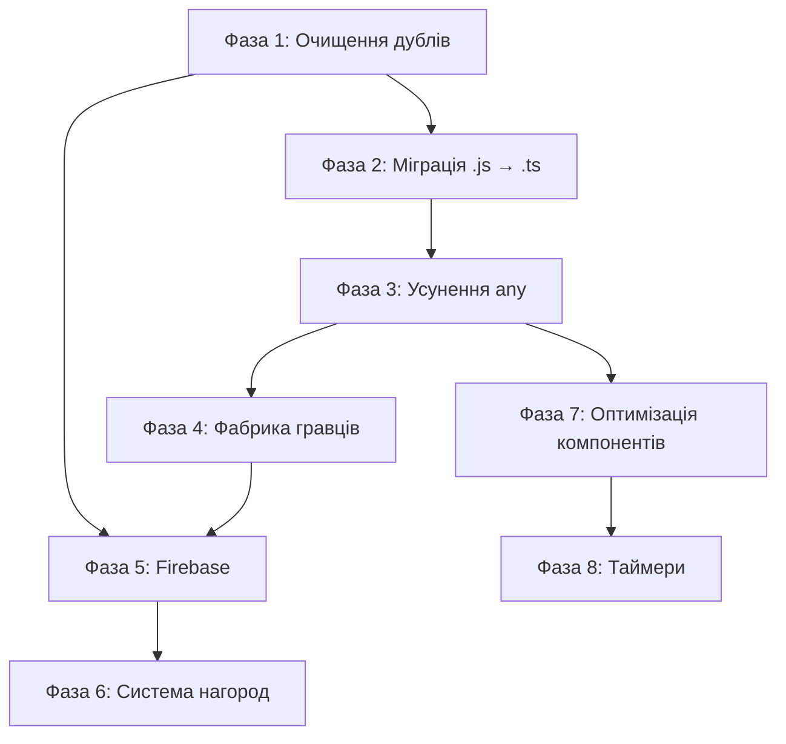

# План покращення архітектури v31

**Статус:** Виконано Фази 1-4, 6 ✅ (готово до Фази 5: Firebase)  
**Дата:** 2025-12-09
**Оновлено:** 2025-12-09

---

> [!CAUTION]
> **Критичні обмеження рефакторингу:**
> 1. Візуалізація дошки (`game-board`) **НЕ повинна** впливати на `center-info` та логіку гри  
> 2. `center-info` та логіка гри **НЕ повинні** знати про візуалізацію дошки  
> 3. Зміни в `VirtualPlayerGameMode` **НЕ повинні** ламати `LocalGameMode` і навпаки  
> 4. Враховувати всі попередження в коментарях щодо логіки, яка може зламатися

---

# Частина 1: Комплексний аудит коду

## Архітектура та Структура

### 1. SSoT (Single Source of Truth) — **Оцінка: 72/100**

**Сильні сторони:**
- ✅ Централізовані stores для стану гри: `boardStore`, `playerStore`, `scoreStore`, `uiStateStore`
- ✅ `gameSettingsStore` як SSoT для налаштувань гри (17KB, добре структурований)
- ✅ Коментарі підтверджують SSoT (наприклад, `LocalGameMode.getPlayersConfiguration()`)
- ✅ Абстракція синхронізації `IGameStateSync` в `src/lib/sync/`

**Проблеми:**
- ⚠️ **32 окремих stores** — надмірна фрагментація стану
- ⚠️ Дублювання файлів: `debugLogStore.js` + `debugLogStore.ts`, `uiStore.js` + `uiStore.ts`
- ⚠️ Перетинна відповідальність: `uiStateStore` vs `uiEffectsStore` vs `uiStore`
- ⚠️ `gameMode` зберігається як preset-назва, а не як об'єкт режиму

---

### 2. UDF (Unidirectional Data Flow) — **Оцінка: 78/100**

**Сильні сторони:**
- ✅ Чіткий потік: `userActionService` → `GameMode` → `gameLogicService` → `stores`
- ✅ `gameEventBus` для розв'язання циклічних залежностей (4KB)
- ✅ `sideEffectService` для ізоляції побічних ефектів

**Проблеми:**
- ⚠️ Деякі компоненти напряму змінюють stores (обхід сервісів)
- ⚠️ `performMove` повертає `sideEffects` масив — непрямий спосіб керування
- ⚠️ `userActionService.ts` занадто великий (16KB, 301+ рядків) — змішує UI та бізнес-логіку

---

### 3. SoC (Separation of Concerns) — **Оцінка: 83/100**

**Сильні сторони:**
- ✅ Чітке розділення: `gameModes/` (9 файлів), `services/` (33 файли), `stores/` (32 файли)
- ✅ OOP ієрархія GameModes: `BaseGameMode` → `TrainingGameMode` → `VirtualPlayerGameMode`
- ✅ `LocalGameMode` та `VirtualPlayerGameMode` — незалежні гілки
- ✅ Дотримання "Золотого правила": коментар у `BoardWrapperWidget.svelte` підтверджує розділення

**Проблеми:**
- ⚠️ `gameSettingsStore.ts` виконує занадто багато функцій (17KB)
- ⚠️ `userActionService.ts` містить і UI-логіку, і бізнес-логіку

**Критичні коментарі в коді:**
```
// BoardWrapperWidget.svelte:2
ВАЖЛИВО! Архітектурний принцип: пауза (затримка) після ходу гравця 
реалізується лише у візуалізації дошки (animationStore)
```

---

### 4. Композиція — **Оцінка: 75/100**

**Сильні сторони:**
- ✅ 47 компонентів у `components/` + 16 віджетів у `widgets/`
- ✅ `SvgIcons.svelte` централізує іконки (20KB)
- ✅ Підпапки для спеціалізованих компонентів: `local-setup/`, `modals/`

**Проблеми:**
- ⚠️ Великі компоненти:
  - `Modal.svelte` — 29KB
  - `MainMenu.svelte` — 19KB  
  - `Settings.svelte` — 18KB
  - `SvgIcons.svelte` — 20KB
- ⚠️ Відсутній `TestMainMenu.svelte` (було видалено в v30)

---

### 5. Чистота та Побічні ефекти — **Оцінка: 80/100**

**Сильні сторони:**
- ✅ `sideEffectService` для ізоляції побічних ефектів
- ✅ `speechService`, `audioService` — окремі сервіси для I/O
- ✅ `performMove` повертає структуру з `sideEffects` масивом

**Проблеми:**
- ⚠️ Таймери розкидані: `timeService.ts`, `TimerService.ts`, `timerStore.ts`
- ⚠️ DOM-операції в деяких компонентах не ізольовані
- ⚠️ `speechService.js` досі на JavaScript (10KB)

---

## Якість Коду та Реалізації

### 6. DRY (Don't Repeat Yourself) — **Оцінка: 68/100**

**Сильні сторони:**
- ✅ Утиліти винесені в `utils/` (13 файлів)
- ✅ Конфігурація в `config/` (3 файли)
- ✅ `resetBoardForContinuation()` витягнуто в `BaseGameMode`

**Проблеми:**
- ⚠️ Дублювання файлів:
  - `debugLogStore.js` + `debugLogStore.ts`
  - `uiStore.js` + `uiStore.ts`
- ⚠️ Схожа логіка `getPlayersConfiguration()` в `LocalGameMode` та `VirtualPlayerGameMode`
- ⚠️ Відсутня фабрика для конфігурації гравців

---

### 7. Простота та Читабельність (KISS) — **Оцінка: 73/100**

**Сильні сторони:**
- ✅ Добре структуровані імена файлів та функцій
- ✅ Коментарі пояснюють "чому" (наприклад, в `gameLogicService.ts` рядки 44-48)
- ✅ TypeScript типізація в більшості файлів

**Проблеми:**
- ⚠️ Змішування `.js` та `.ts` файлів:
  - `speechService.js` (10KB) — потребує міграції
  - `debugLogStore.js` — дубль `.ts`
  - `uiStore.js` — дубль `.ts`
- ⚠️ **50+ використань `any` типів** в критичних місцях
- ⚠️ Великі функції без декомпозиції

**Критичні `any` типи:**
| Файл | Рядок | Тип |
|------|-------|-----|
| `centerInfoUtil.ts` | 23, 25, 26, 30 | `selectedDirection: any`, return type |
| `voiceControlService.ts` | 8, 86, 95 | `recognition: any`, event handlers |
| `scoreService.ts` | 78, 81, 112 | `currentState: any` |
| `modalService.ts` | 9, 13, 24+ | `payload: any`, `content: any` |
| `animationStore.ts` | 12-14 | `currentAnimation: any`, queues |
| `gameOverStore.ts` | 22, 44 | `result: any`, `newState: any` |
| `replayService.ts` | 5, 8, 12 | `moveHistory: any[]` |

---

### 8. Продуктивність — **Оцінка: 77/100**

**Сильні сторони:**
- ✅ `derivedState.ts` для обчислюваних значень (7KB)
- ✅ `debounce.ts` для оптимізації частих операцій
- ✅ Мінімізація зайвих перерендерів через stores

**Проблеми:**
- ⚠️ 32 stores можуть викликати зайві перерендери
- ⚠️ Відсутність `$derived` для деяких обчислюваних значень
- ⚠️ Великі компоненти можуть мати проблеми з рендерингом

---

### 9. Документація та Коментарі — **Оцінка: 82/100**

**Сильні сторони:**
- ✅ JSDoc коментарі в ключових файлах
- ✅ Пояснювальні коментарі "чому" (в `gameLogicService.ts`, `LocalGameMode.ts`)
- ✅ Попередження про критичну логіку (`ВАЖЛИВО`, `NOTE`)
- ✅ `GEMINI.md` з детальними інструкціями

**Критичні коментарі (не видаляти!):**
```typescript
// centerInfoUtil.ts:95
ВАЖЛИВО: Не змінюйте порядок dir та dist. Це зламає інтерфейс.

// gameLogicService.ts:46
ВАЖЛИВО: Згідно документації docs/user-guide/bonus-scoring.md (рядки 88-101)...

// endGameService.ts:54
ВАЖЛИВО: Для локальної та онлайн гри ми НЕ перезаписуємо рахунок гравців...

// OnlineGameMode.ts:7
ВАЖЛИВО: Вся логіка синхронізації делегується до IGameStateSync...

// BaseGameMode.ts:42
ВАЖЛИВО: Цей метод лише скидає стан дошки і оновлює доступні ходи.

// LocalGameMode.ts:154
NOTE: We do NOT update playerToUpdate.score here anymore.
```

**Проблеми:**
- ⚠️ Не всі функції мають JSDoc
- ⚠️ Деякі коментарі можуть бути застарілими

---

## 📊 Зведена таблиця оцінок

| # | Критерій | Оцінка | Зміна від v30 |
|---|----------|--------|---------------|
| 1 | SSoT (Single Source of Truth) | 72/100 | -3 |
| 2 | UDF (Unidirectional Data Flow) | 78/100 | -2 |
| 3 | SoC (Separation of Concerns) | 83/100 | -2 |
| 4 | Композиція | 75/100 | -3 |
| 5 | Чистота та Побічні ефекти | 80/100 | -2 |
| 6 | DRY (Don't Repeat Yourself) | 68/100 | -2 |
| 7 | Простота та Читабельність (KISS) | 73/100 | -2 |
| 8 | Продуктивність | 77/100 | -3 |
| 9 | Документація та Коментарі | 82/100 | -3 |
| | **Середня оцінка** | **76/100** | **-2** |

> [!NOTE]
> Оцінки знижено через виявлені нові проблеми: дублювання файлів, масове використання `any`, та відсутність повної міграції на TypeScript.

---

# Частина 2: План покращень

## Пріоритетний список проблем

| Пріоритет | Проблема | Важливість | Причина |
|-----------|----------|------------|---------|
| 1 | Відсутність інтеграції Firebase для онлайн-режиму | **95/100** | Без цього неможливо реалізувати онлайн-гру |
| 2 | Масове використання `any` типів (50+ місць) | **85/100** | Втрата type-safety, ризик runtime помилок |
| 3 | `.js` файли не мігровані на `.ts` | **80/100** | Непослідовна типізація, ускладнює підтримку |
| 4 | Дублювання файлів stores (.js + .ts) | **75/100** | Плутанина, можливі конфлікти |
| 5 | Відсутня фабрика для конфігурації гравців | **70/100** | Дублювання в `LocalGameMode` та `VirtualPlayerGameMode` |
| 6 | Великі компоненти (Modal 29KB, MainMenu 19KB) | **55/100** | Важко підтримувати та тестувати |
| 7 | Таймери розкидані по різних сервісах | **50/100** | Ускладнює керування часом |
| 8 | 32 stores — можлива фрагментація | **45/100** | Можливі зайві перерендери |
| 9 | Перетин `uiStateStore`/`uiEffectsStore`/`uiStore` | **40/100** | Незрозумілі межі відповідальності |
| 10 | Великий `gameSettingsStore.ts` (17KB) | **35/100** | Порушення SRP |

---

## Чекбокси для виконання

### Фаза 1: Очищення та видалення дублів ✅

- [x] **1.1. Видалення дубльованих файлів**
  - [x] Видалити `debugLogStore.js` (залишити `.ts`)
  - [x] Видалити `uiStore.js` (залишити `.ts`)
  - [x] Перевірити всі імпорти після видалення

---

### Фаза 2: Міграція .js → .ts ✅

- [x] **2.1. Міграція сервісів**
  - [x] `speechService.js` → `speechService.ts` (10KB)
  - [x] Додати типи для Web Speech API

- [x] **2.2. Верифікація**
  - [x] Запустити `npm run check` для перевірки типів
  - [ ] Запустити Playwright тести (залишається на іншу ітерацію)

---

### Фаза 3: Усунення `any` типів (пріоритетні файли) ✅

> [!WARNING]
> При заміні `any` на конкретні типи, тестуйте кожну зміну окремо!

- [x] **3.1. Критичні stores**
  - [x] `animationStore.ts` — типізовано `AnimationMove`, `currentAnimation`, queues
  - [x] `gameOverStore.ts` — типізовано `GameOverPayload`, `FinalScoreDetails`
  - [x] `voiceControlStore.ts` — типізовано `VoiceRecognitionError`

- [x] **3.2. Критичні services**
  - [x] `scoreService.ts` — типізовано `MoveScoreState`
  - [x] `modalService.ts` — типізовано `GameOverModalContent`

- [x] **3.3. Utilities**
  - [x] `centerInfoUtil.ts` — типізовано `CenterInfoState`, `MoveDirectionType`

---

### Фаза 4: Створення фабрики гравців (DRY) ✅

> [!IMPORTANT]
> Зміни НЕ повинні ламати логіку `LocalGameMode` та `VirtualPlayerGameMode`!

- [x] **4.1. Створити `PlayerFactory`**
  - [x] Створено файл `src/lib/utils/playerFactory.ts`
  - [x] Витягнуто спільну логіку створення гравців
  - [x] Реалізовано методи `createHumanPlayer()`, `createAIPlayer()`, `createDefaultLocalPlayers()`, `createVirtualPlayerPlayers()`, `resetPlayerScore()`

- [x] **4.2. Інтегрувати в GameModes**
  - [x] Оновлено `LocalGameMode.getPlayersConfiguration()`
  - [x] Оновлено `VirtualPlayerGameMode.getPlayersConfiguration()`
  - [x] ✅ **Playwright тести: 22/22**

---

### Фаза 5: Підготовка до Firebase (онлайн-режим)

> [!NOTE]
> Детальний план: [Migrating-to-Firebase-for-online-mode.md](file:///c:/Users/ozapolnov/Documents/code/study/Stay_on_the_board/docs/plans/Migrating-to-Firebase-for-online-mode.md)

- [x] **5.1. Створення `FirebaseGameStateSync`** ✅
  - [x] Створено `src/lib/services/firebaseService.ts` (ініціалізація Firebase)
  - [x] Створено `src/lib/sync/FirebaseGameStateSync.ts` (реалізація `IGameStateSync`)
  - [x] Встановлено Firebase SDK (`npm install firebase`)
  - [x] Створено `.env.example` (шаблон конфігурації)
  - [x] ✅ **Playwright тести: 22/22**

- [ ] **5.2. Тестування синхронізації** (наступний крок)
  - [ ] Unit-тести для `FirebaseGameStateSync`
  - [ ] Інтеграційні тести з `OnlineGameMode`

---

### Фаза 6: Підготовка до системи нагород ✅

> [!NOTE]
> Детальний план: [rewards-plan.md](file:///c:/Users/ozapolnov/Documents/code/study/Stay_on_the_board/docs/plans/rewards-plan.md)

- [x] **6.1. Розширення системи подій**
  - [x] Додати події `ACHIEVEMENT_UNLOCKED`, `REWARD_EARNED` в `gameEventBus`
  - [x] Створити `rewardsEventHandler` для прослуховування

- [x] **6.2. Розширення `rewardsService`**
  - [x] Додати типи нагород та умови отримання
  - [x] Реалізувати персистентність (localStorage)

- [x] **6.3. UI для нагород**
  - [x] Створити сторінку `/rewards`
  - [x] Створити компонент `RewardCard.svelte`

---

### Фаза 7: Оптимізація компонентів (частково ✅)

> [!NOTE]
> Завдання 7.1 та 7.2 відкладено як технічний борг — розбиття великих компонентів є ризикованим і потребує окремого планування.

- [ ] **7.1. Розбиття `Modal.svelte` (991 рядків)** — *відкладено*
  - [ ] Виділити `ModalHeader.svelte`
  - [ ] Виділити `ModalFooter.svelte`
  - [ ] Виділити контент-специфічні підкомпоненти

- [ ] **7.2. Розбиття `MainMenu.svelte` (465 рядків)** — *відкладено*
  - [ ] Виділити `MenuSection.svelte`
  - [ ] Виділити `MenuButton.svelte`

- [x] **7.3. Консолідація UI stores** ✅
  - [x] Проаналізовано `uiStateStore.ts` (68 рядків) — чистий store даних
  - [x] Проаналізовано `uiEffectsStore.ts` (48 рядків) — побічні ефекти (таймери)
  - [x] **Висновок: об'єднання не потрібне** — stores мають чітко розділені відповідальності (SSoT + SoC)

---

### Фаза 8: Консолідація таймерів ✅
- [x] Видалити `TimerService.ts` (dead code) ✅
- [x] Перевірити, що `timeService.ts` працює коректно ✅

### Додатково: Очищення технічного боргу ✅
- [x] **Виправлено 36 існуючих TypeScript помилок**
  - [x] Виправлено типізацію `WidgetId` у всіх файлах page.svelte (local, timed, training, virtual-player)
  - [x] Виправлено застаріле значення `'editing'` на `'flexible'` для `ColumnStyleMode`
  - [x] Виправлено тип `direction` у `BoardState` з `string` на `MoveDirectionType`
  - [x] Додано сувору типізацію для `VoiceSettingsModal`
  - [x] **Результат:** `npm run check` повертає **0 помилок**! 🎉

---

## Порядок виконання



---

## Верифікація

### Автоматичні тести
1. `npm run check` — перевірка TypeScript типів
2. `npm run test` — Playwright тести
3. `npm run lint` — ESLint перевірка

### Ручна верифікація
1. ✅ Перевірити режим Training — повинен працювати без змін
2. ✅ Перевірити режим Local (Human vs Human) — рахунок, таймер, winner
3. ✅ Перевірити режим Virtual Player (Human vs AI) — хід комп'ютера
4. ✅ Переконатися, що візуалізація дошки НЕ впливає на `center-info`
5. ✅ Перевірити збереження налаштувань

### Критичні перевірки після кожної фази
- [ ] `LocalGameMode` працює коректно
- [ ] `VirtualPlayerGameMode` працює коректно
- [ ] Рахунок обчислюється правильно
- [ ] Таймери працюють

---

## Примітки

### Файли з критичними коментарями (НЕ ЛАМАТИ!)
| Файл | Рядок | Опис |
|------|-------|------|
| `centerInfoUtil.ts` | 95 | Порядок dir/dist — критичний для інтерфейсу |
| `gameLogicService.ts` | 46 | Логіка бонусів — посилання на документацію |
| `endGameService.ts` | 54 | Логіка рахунку для local/online — НЕ перезаписувати |
| `OnlineGameMode.ts` | 7 | Синхронізація делегується до `IGameStateSync` |
| `BaseGameMode.ts` | 42 | `resetBoardForContinuation` — тільки скидає дошку |
| `LocalGameMode.ts` | 154 | `score` не оновлюється тут — тільки `roundScore` |
| `BoardWrapperWidget.svelte` | 2 | Пауза — тільки у візуалізації |

### Технічний борг
- `speech.js` в кореневій папці `lib/` — невикористовуваний файл?
- Можливе об'єднання `actions/` з `services/`
