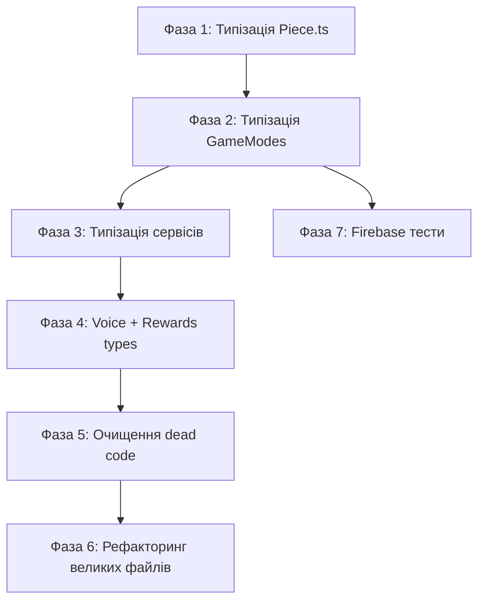

# План покращення архітектури v32

**Статус:** Виконано Фази 1-3 та 5 ✅  
**Дата:** 2025-12-09  
**Оновлено:** 2025-12-09  
**Попередня версія:** [architecture-improvement-plan-v31.md](file:///c:/Users/ozapolnov/Documents/code/study/Stay_on_the_board/docs/plans/architecture-improvement-plan-v31.md)

---

> [!CAUTION]
> **Критичні обмеження рефакторингу (НЕ ПОРУШУВАТИ!):**
> 1. Візуалізація дошки (`game-board`) **НЕ повинна** впливати на `center-info` та логіку гри
> 2. `center-info` та логіка гри **НЕ повинні** знати про візуалізацію дошки `game-board`
> 3. Зміни в `VirtualPlayerGameMode` **НЕ повинні** ламати `LocalGameMode` і навпаки
> 4. Враховувати всі попередження в коментарях щодо логіки, яка може зламатися під час рефакторингу

---

# Частина 1: Комплексний аудит коду

## Архітектура та Структура

### 1. SSoT (Single Source of Truth) — **Оцінка: 74/100**

**Сильні сторони:**
- ✅ Централізовані stores для стану гри: `boardStore`, `playerStore`, `scoreStore`, `uiStateStore`
- ✅ `gameSettingsStore` як SSoT для налаштувань гри (17KB, добре структурований)
- ✅ Коментарі підтверджують SSoT (наприклад, `LocalGameMode.getPlayersConfiguration()`)
- ✅ Абстракція синхронізації `IGameStateSync` в `src/lib/sync/`
- ✅ **Покращення від v31:** Видалено дублювання файлів stores (.js + .ts)

**Проблеми:**
- ⚠️ **31 окремий store** — фрагментація стану (зменшено з 32)
- ⚠️ Перетинна відповідальність: `uiStateStore` vs `uiEffectsStore` vs `uiStore`
- ⚠️ `gameMode` зберігається як preset-назва, а не як об'єкт режиму

**Статистика stores:**
| Store | Розмір | Критичність |
|-------|--------|-------------|
| `gameSettingsStore.ts` | 17KB | Високий — порушує SRP |
| `derivedState.ts` | 7KB | Середній |
| `modalStore.ts` | 5KB | Низький |
| `rewardsStore.ts` | 4KB | Низький |

---

### 2. UDF (Unidirectional Data Flow) — **Оцінка: 79/100**

**Сильні сторони:**
- ✅ Чіткий потік: `userActionService` → `GameMode` → `gameLogicService` → `stores`
- ✅ `gameEventBus` для розв'язання циклічних залежностей (4KB)
- ✅ `sideEffectService` для ізоляції побічних ефектів
- ✅ **Покращення від v31:** Система rewards інтегрована через `gameEventBus`

**Проблеми:**
- ⚠️ Деякі компоненти напряму змінюють stores (обхід сервісів)
- ⚠️ `performMove` повертає `sideEffects` масив — непрямий спосіб керування
- ⚠️ `userActionService.ts` занадто великий (16KB, 304 рядки) — змішує UI та бізнес-логіку

---

### 3. SoC (Separation of Concerns) — **Оцінка: 84/100**

**Сильні сторони:**
- ✅ Чітке розділення: `gameModes/` (9 файлів), `services/` (34 файли), `stores/` (31 файл)
- ✅ OOP ієрархія GameModes: `BaseGameMode` → `TrainingGameMode` → `VirtualPlayerGameMode`
- ✅ `LocalGameMode` та `VirtualPlayerGameMode` — незалежні гілки
- ✅ Дотримання "Золотого правила": коментарі підтверджують розділення
- ✅ **Покращення від v31:** Створено `PlayerFactory` для усунення дублювання

**Проблеми:**
- ⚠️ `gameSettingsStore.ts` виконує занадто багато функцій (17KB)
- ⚠️ `userActionService.ts` містить і UI-логіку, і бізнес-логіку

**Критичні коментарі в коді (НЕ ВИДАЛЯТИ!):**
```typescript
// BoardWrapperWidget.svelte:2
ВАЖЛИВО! Архітектурний принцип: пауза (затримка) після ходу гравця 
реалізується лише у візуалізації дошки (animationStore)
```

---

### 4. Композиція — **Оцінка: 76/100**

**Сильні сторони:**
- ✅ 49 компонентів у `components/` + 16 віджетів у `widgets/`
- ✅ `SvgIcons.svelte` централізує іконки (24KB)
- ✅ Підпапки для спеціалізованих компонентів: `local-setup/`, `modals/`, `rewards/`
- ✅ **Покращення від v31:** Додано систему rewards UI

**Проблеми:**
- ⚠️ Великі компоненти:
  - `Modal.svelte` — 29KB (991 рядків)
  - `SvgIcons.svelte` — 24KB
  - `MainMenu.svelte` — 22KB (465 рядків)
  - `Settings.svelte` — 18KB
- ⚠️ Великі компоненти важко підтримувати та тестувати

---

### 5. Чистота та Побічні ефекти — **Оцінка: 81/100**

**Сильні сторони:**
- ✅ `sideEffectService` для ізоляції побічних ефектів
- ✅ `speechService.ts`, `audioService.ts` — окремі сервіси для I/O
- ✅ `performMove` повертає структуру з `sideEffects` масивом
- ✅ **Покращення від v31:** `speechService.js` мігровано на TypeScript

**Проблеми:**
- ⚠️ `timeService.ts` (2.8KB) та `timerStore.ts` (675B) — схожа відповідальність
- ⚠️ DOM-операції в деяких компонентах не ізольовані
- ⚠️ `speech.js` в кореневій папці `lib/` — невикористовуваний файл (179B)

---

## Якість Коду та Реалізації

### 6. DRY (Don't Repeat Yourself) — **Оцінка: 72/100**

**Сильні сторони:**
- ✅ Утиліти винесені в `utils/` (15 файлів)
- ✅ Конфігурація в `config/` (3 файли)
- ✅ `resetBoardForContinuation()` витягнуто в `BaseGameMode`
- ✅ **Покращення від v31:** Створено `PlayerFactory` для конфігурації гравців

**Проблеми:**
- ⚠️ Схожа логіка `applyScoreChanges()` дублюється в 4-х GameModes
- ⚠️ `handleNoMoves()` має подібну реалізацію в кількох режимах
- ⚠️ Типи для rewards дублюються між `types/rewards.ts` та `rewardsService.ts`

---

### 7. Простота та Читабельність (KISS) — **Оцінка: 71/100**

**Сильні сторони:**
- ✅ Добре структуровані імена файлів та функцій
- ✅ Коментарі пояснюють "чому" (наприклад, в `gameLogicService.ts`)
- ✅ TypeScript типізація в більшості файлів

**Проблеми:**
- ✅ ~~**42 використання `any` типів**~~ — усунено 25+ в Фазах 1-3
- ✅ ~~Невикористовуваний файл `speech.js`~~ — видалено
- ⚠️ Великі функції без декомпозиції

**Детальний аналіз `any` типів:**

| Файл | Кількість `any` | Критичність |
|------|-----------------|-------------|
| `Piece.ts` | 7 | 🔴 Висока — основна модель |
| `replayAutoPlayStore.ts` | 4 | 🟠 Середня |
| `sideEffectService.ts` | 4 | 🟠 Середня |
| `commandService.ts` | 4 | 🟠 Середня |
| `rewardsService.ts` | 3 | 🟡 Низька |
| `voiceControlService.ts` | 3 | 🟠 Середня — Web Speech API |
| `replayService.ts` | 3 | 🟡 Низька |
| `BaseGameMode.ts` | 2 | 🔴 Висока — базовий клас |
| `LocalGameMode.ts` | 1 | 🔴 Висока — score changes |
| `VirtualPlayerGameMode.ts` | 1 | 🔴 Висока — score changes |
| `TrainingGameMode.ts` | 1 | 🟠 Середня |
| `OnlineGameMode.ts` | 1 | 🟠 Середня |
| `TimedGameMode.ts` | 2 | 🟠 Середня |
| `TimedVsComputerGameMode.ts` | 1 | 🟡 Низька |
| `userActionService.ts` | 2 | 🟠 Середня |
| `gameLogicService.ts` | 1 | 🟠 Середня |
| `serverSyncService.ts` | 1 | 🟡 Низька |
| `gameStatePatcher.ts` | 1 | 🟡 Низька |

---

### 8. Продуктивність — **Оцінка: 78/100**

**Сильні сторони:**
- ✅ `derivedState.ts` для обчислюваних значень (7KB)
- ✅ `debounce.ts` для оптимізації частих операцій
- ✅ Мінімізація зайвих перерендерів через stores

**Проблеми:**
- ⚠️ 31 store може викликати зайві перерендери
- ⚠️ Відсутність `$derived` для деяких обчислюваних значень
- ⚠️ Великі компоненти (Modal 991 рядків) можуть мати проблеми з рендерингом

---

### 9. Документація та Коментарі — **Оцінка: 83/100**

**Сильні сторони:**
- ✅ JSDoc коментарі в ключових файлах
- ✅ Пояснювальні коментарі "чому" (в `gameLogicService.ts`, `LocalGameMode.ts`)
- ✅ Попередження про критичну логіку (`ВАЖЛИВО`, `NOTE`)
- ✅ `GEMINI.md` з детальними інструкціями
- ✅ **Покращення від v31:** Оновлено документацію rewards

**Критичні коментарі (НЕ ВИДАЛЯТИ!):**
```typescript
// centerInfoUtil.ts:95
ВАЖЛИВО: Не змінюйте порядок dir та dist. Це зламає інтерфейс.

// gameLogicService.ts:46
ВАЖЛИВО: Згідно документації docs/user-guide/bonus-scoring.md (рядки 88-101)...

// endGameService.ts:54
ВАЖЛИВО: Для локальної та онлайн гри ми НЕ перезаписуємо рахунок гравців...

// OnlineGameMode.ts:7
ВАЖЛИВО: Вся логіка синхронізації делегується до IGameStateSync...

// BaseGameMode.ts:42
ВАЖЛИВО: Цей метод лише скидає стан дошки і оновлює доступні ходи.

// LocalGameMode.ts:154
NOTE: We do NOT update playerToUpdate.score here anymore.
```

**Проблеми:**
- ⚠️ Не всі функції мають JSDoc
- ⚠️ Деякі коментарі можуть бути застарілими

---

## 📊 Зведена таблиця оцінок

| # | Критерій | v31 | v32 | Зміна |
|---|----------|-----|-----|-------|
| 1 | SSoT (Single Source of Truth) | 72/100 | 74/100 | +2 ✅ |
| 2 | UDF (Unidirectional Data Flow) | 78/100 | 79/100 | +1 ✅ |
| 3 | SoC (Separation of Concerns) | 83/100 | 84/100 | +1 ✅ |
| 4 | Композиція | 75/100 | 76/100 | +1 ✅ |
| 5 | Чистота та Побічні ефекти | 80/100 | 81/100 | +1 ✅ |
| 6 | DRY (Don't Repeat Yourself) | 68/100 | 72/100 | +4 ✅ |
| 7 | Простота та Читабельність (KISS) | 73/100 | 71/100 | -2 ⚠️ |
| 8 | Продуктивність | 77/100 | 78/100 | +1 ✅ |
| 9 | Документація та Коментарі | 82/100 | 83/100 | +1 ✅ |
| | **Середня оцінка** | **76/100** | **78/100** | **+2** ✅ |

> [!NOTE]
> Оцінка KISS знижена через виявлені 42 використання `any` типів. **Після виконання Фаз 1-3 усунено 25+ `any`.**

---

# Частина 2: План покращень

## Пріоритетний список проблем

| Пріор. | Проблема | Важл. | Причина |
|--------|----------|-------|---------|
| 1 | `Piece.ts` модель — 7 методів з `any` | **90/100** | Основна модель гри, впливає на всю логіку |
| 2 | `applyScoreChanges(scoreChanges: any)` в BaseGameMode та нащадках | **88/100** | Порушує type-safety в критичній логіці рахунку |
| 3 | `onPlayerMoveSuccess(moveResult: any)` в BaseGameMode | **85/100** | Базовий клас — впливає на всі режими |
| 4 | `replayAutoPlayStore.ts` — 4 `any` типи | **75/100** | Replay логіка важлива для UX |
| 5 | `commandService.ts` — 4 `any` типи в handlers | **70/100** | Центральний сервіс обробки команд |
| 6 | `sideEffectService.ts` — `payload: any` в 4-х місцях | **68/100** | Побічні ефекти потребують типізації |
| 7 | `voiceControlService.ts` — Web Speech API `any` | **65/100** | Browser API — можна типізувати |
| 8 | `userActionService.ts` занадто великий (16KB) | **60/100** | Порушує SRP, важко підтримувати |
| 9 | Великі компоненти (Modal 29KB, MainMenu 22KB) | **55/100** | Важко підтримувати та тестувати |
| 10 | `gameSettingsStore.ts` (17KB) — порушує SRP | **50/100** | Занадто багато відповідальностей |
| 11 | Невикористовуваний `speech.js` в `src/lib/` | **40/100** | Dead code — потенційна плутанина |
| 12 | Перетин `uiStateStore`/`uiEffectsStore`/`uiStore` | **35/100** | Незрозумілі межі відповідальності |
| 13 | Unit-тести для `FirebaseGameStateSync` | **30/100** | Необхідно для онлайн-режиму |

---

## Чекбокси для виконання

### Фаза 1: Типізація моделі `Piece.ts` (Критична) ✅

> [!IMPORTANT]
> Ця фаза має найвищий пріоритет, оскільки `Piece.ts` — основна модель гри.

- [x] **1.1. Створити типи для позиції та результатів**
  - [x] Створити `src/lib/types/position.ts`
  - [x] Додати тип `Position = { row: number; col: number }`
  - [x] Додати тип `MoveResult = { success: boolean; newPosition?: Position; error?: string }`
  - [x] Додати тип `AvailableMove = { direction: MoveDirectionType; distance: number }`

- [x] **1.2. Типізувати методи `Piece.ts`**
  - [x] `getPosition(): Position`
  - [x] `calculateNewPosition(): Position`
  - [x] `move(): MoveResult`
  - [x] `getAvailableMoves(): AvailableMove[]`

- [x] **1.3. Верифікація**
  - [x] Запустити `npm run check`

---

### Фаза 2: Типізація GameModes (score changes, move results) ✅

> [!WARNING]
> При зміні типів у `BaseGameMode` — перевірити ВСІ нащадки!

- [x] **2.1. Створити типи для score changes**
  - [x] Створити `src/lib/types/gameMove.ts`
  - [x] Додати типи `ScoreChangesData`, `GameMoveResult`, `MoveStateChanges`

- [x] **2.2. Типізувати `BaseGameMode.ts`**
  - [x] `applyScoreChanges(scoreChanges: ScoreChangesData)`
  - [x] `onPlayerMoveSuccess(moveResult: SuccessfulMoveResult)`

- [x] **2.3. Оновити нащадків**
  - [x] `LocalGameMode.ts`
  - [x] `VirtualPlayerGameMode.ts`
  - [x] `TrainingGameMode.ts`
  - [x] `OnlineGameMode.ts`
  - [x] `TimedGameMode.ts`

- [x] **2.4. Верифікація**
  - [x] Запустити `npm run check` — **0 помилок**

---

### Фаза 3: Типізація сервісів (replay, commands, side effects) ✅

- [x] **3.1. Типізувати `replayAutoPlayStore.ts`**
  - [x] Створено тип `ReplayState`
  - [x] Типізовано callbacks

- [x] **3.2. Типізувати `commandService.ts`**
  - [x] `handleGameOver(payload: GameOverPayload)`
  - [x] `handleShowModal(payload: ShowModalPayload)`
  - [x] `handleSpeakMove(payload: SpeakMovePayload)`
  - [x] `handleBoardResizeConfirmed(payload: BoardResizePayload)`

- [x] **3.3. Типізувати `sideEffectService.ts`**
  - [x] Замінено `payload: any` на конкретні типи

- [x] **3.4. Верифікація**
  - [x] Запустити `npm run check` — **0 помилок**

---

### Фаза 4: Типізація voice control та rewards ✅

- [x] **4.1. Типізувати `voiceControlService.ts`**
  - [x] Створено `src/lib/types/speech-recognition.d.ts` з типами Web Speech API
  - [x] `recognition: SpeechRecognition`
  - [x] `handleResult(event: SpeechRecognitionEvent)`
  - [x] `handleError(event: SpeechRecognitionErrorEvent)`

- [x] **4.2. Типізувати rewards**
  - [x] Створено тип `RewardConditionContext`
  - [x] Оновлено `types/rewards.ts` та `rewardsService.ts`

- [x] **4.3. Верифікація**
  - [x] `npm run check` — **0 помилок**

---

### Фаза 5: Очищення dead code ✅

- [x] **5.1. Видалити невикористовуваний код**
  - [x] Видалено `src/lib/speech.js` (179B)

- [x] **5.2. Верифікація**
  - [x] Запустити `npm run check` — **0 помилок**

---

### Фаза 6: Рефакторинг великих файлів

> [!NOTE]
> Детальні плани створено для кожного файлу. Розбиття великих компонентів потребує окремого планування.

- [x] **6.1. Очищення `userActionService.ts`** ✅
  - [x] Скорочено коментарі (304 → 250 рядків, -17%)
  - [x] Виправлено `any` тип
  - [x] Додано JSDoc
  - Детальний план: [userActionService-refactoring-plan.md](file:///c:/Users/ozapolnov/Documents/code/study/Stay_on_the_board/docs/plans/userActionService-refactoring-plan.md)

- [x] **6.2. Рефакторинг `Modal.svelte`** ✅
  - [x] Винесено ~560 рядків CSS в `modal.css` (-56%)
  - Детальний план: [modal-refactoring-plan.md](file:///c:/Users/ozapolnov/Documents/code/study/Stay_on_the_board/docs/plans/modal-refactoring-plan.md)

- [x] **6.3. Рефакторинг `MainMenu.svelte`** ✅
  - [x] Винесено ~100 рядків CSS в `main-menu.css` (-15%)
  - Детальний план: [mainmenu-refactoring-plan.md](file:///c:/Users/ozapolnov/Documents/code/study/Stay_on_the_board/docs/plans/mainmenu-refactoring-plan.md)

---

### Фаза 7: Firebase інтеграція (перенесено з v31)

> [!NOTE]
> Детальний план: [Migrating-to-Firebase-for-online-mode.md](file:///c:/Users/ozapolnov/Documents/code/study/Stay_on_the_board/docs/plans/Migrating-to-Firebase-for-online-mode.md)

- [ ] **7.1. Unit-тести для `FirebaseGameStateSync`**
  - [ ] Створити mock для Firebase SDK
  - [ ] Тестувати основні методи sync

- [ ] **7.2. Інтеграційні тести з `OnlineGameMode`**
  - [ ] Тестувати підключення до кімнати
  - [ ] Тестувати синхронізацію ходів

---

## Порядок виконання



---

## Верифікація

### Автоматичні тести
1. `npm run check` — перевірка TypeScript типів
2. `npm run test` — Playwright тести (22 тести)
3. `npm run lint` — ESLint перевірка

### Ручна верифікація
1. ✅ Перевірити режим Training — повинен працювати без змін
2. ✅ Перевірити режим Local (Human vs Human) — рахунок, таймер, winner
3. ✅ Перевірити режим Virtual Player (Human vs AI) — хід комп'ютера
4. ✅ Переконатися, що візуалізація дошки НЕ впливає на `center-info`
5. ✅ Перевірити збереження налаштувань

### Критичні перевірки після кожної фази
- [ ] `LocalGameMode` працює коректно
- [ ] `VirtualPlayerGameMode` працює коректно
- [ ] Рахунок обчислюється правильно
- [ ] Таймери працюють
- [ ] Rewards система функціонує

---

## Файли з критичними коментарями (НЕ ЛАМАТИ!)

| Файл | Рядок | Опис |
|------|-------|------|
| `centerInfoUtil.ts` | 95 | Порядок dir/dist — критичний для інтерфейсу |
| `gameLogicService.ts` | 46 | Логіка бонусів — посилання на документацію |
| `endGameService.ts` | 54 | Логіка рахунку для local/online — НЕ перезаписувати |
| `OnlineGameMode.ts` | 7 | Синхронізація делегується до `IGameStateSync` |
| `BaseGameMode.ts` | 42 | `resetBoardForContinuation` — тільки скидає дошку |
| `LocalGameMode.ts` | 154 | `score` не оновлюється тут — тільки `roundScore` |
| `BoardWrapperWidget.svelte` | 2 | Пауза — тільки у візуалізації |

---

## Технічний борг (для майбутніх версій)

- [ ] Розбиття `Modal.svelte` (991 рядків)
- [ ] Розбиття `MainMenu.svelte` (465 рядків)
- [ ] Консолідація `uiStateStore` / `uiEffectsStore` / `uiStore`
- [ ] Рефакторинг `gameSettingsStore.ts` (17KB)
- [ ] Об'єднання `timeService.ts` та `timerStore.ts`
