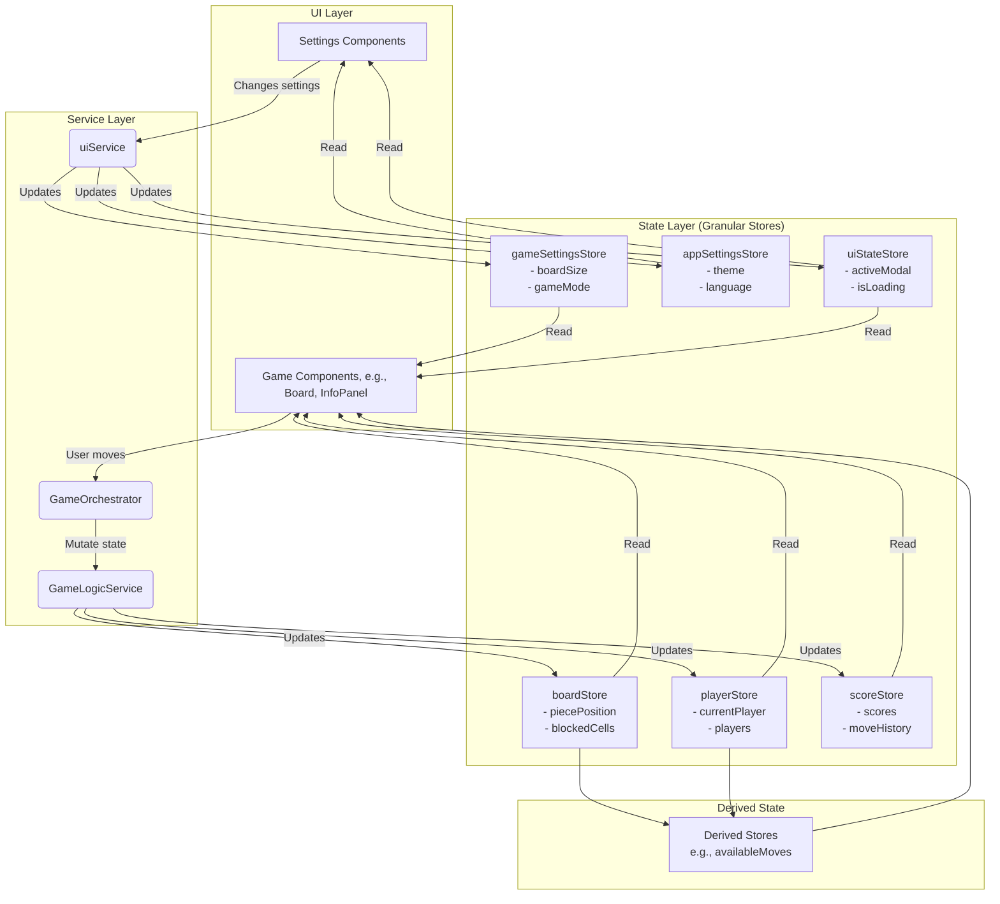

**Пов'язані документи:**
- [Onboarding для розробників](ONBOARDING.md)
- [Архітектура ігрового циклу та потоку даних](architecture/game-logic-and-data-flow.md)
- [Патерни асинхронної візуалізації стану](architecture/patterns-asynchronous-state-visualization.md)
---
last-reviewed: 2025-08-07
---

# Архітектура Проєкту "Stay on the Board"

**Пов'язані документи:**
- [Onboarding для розробників](ONBOARDING.md)
- [Архітектура ігрового циклу та потоку даних](../architecture/game-logic-and-data-flow.md)
- [Патерни асинхронної візуалізації стану](../architecture/PATTERNS-asynchronous-state-visualization.md)

Цей документ описує основні архітектурні принципи, структуру стану та потік даних у застосунку.

## 1. Ключові Принципи

- **Single Source of Truth (SSoT):** Логічний стан гри розділено на декілька гранулярних сторів (`boardStore`, `playerStore`, `scoreStore` тощо), кожен з яких є єдиним джерелом правди для своєї зони відповідальності. Похідні дані обчислюються за допомогою `derived` сторів.
- **Unidirectional Data Flow (UDF):** Потік даних є односпрямованим:
  1.  **UI (Компонент)** викликає дію з **`GameOrchestrator`**.
  2.  **`GameOrchestrator`** викликає чисті функції-мутатори з **`GameLogicService`**.
  3.  **`GameLogicService`** оновлює **`gameState`**.
  4.  **UI (Компонент)** реактивно оновлюється у відповідь на зміну стану.
- **Separation of Concerns (SoC):** Відповідальності чітко розділені між різними модулями (стори, сервіси, компоненти).

## 2. Схема Потоку Даних (UDF)

Діаграма відображає нову, більш гранулярну архітектуру стану.

## 3. Опис Модулів

### 3.1. Стори (`src/lib/stores/`)

Раніше єдиний `gameState` був розділений на декілька незалежних сторів, кожен з яких має свою чітку зону відповідальності. Це спрощує керування станом та зменшує зв'язаність компонентів.

- **`boardStore.ts`**: Відповідає за стан ігрової дошки: позиція фігури, масив заблокованих клітинок.
- **`playerStore.ts`**: Зберігає дані про гравців: хто зараз ходить (`currentPlayer`), масив об'єктів гравців (імена, кольори).
- **`scoreStore.ts`**: Містить усе, що пов'язано з рахунком: поточний рахунок гравців, історія ходів, бонусні очки.
- **`gameSettingsStore.ts`**: Зберігає налаштування, що стосуються *конкретної ігрової сесії*: розмір дошки, режим гри (гравець проти комп'ютера, два гравці), імена гравців. Скидається при старті нової гри.
- **`appSettingsStore.ts`**: Зберігає глобальні налаштування застосунку, що не залежать від ігрової сесії: тема (світла/темна), мова, налаштування анімацій. Зберігається в `localStorage`.
- **`uiStateStore.ts`**: Керує станом інтерфейсу, не пов'язаним напряму з грою: активні модальні вікна, стан завантаження, повідомлення для користувача.
- **`animationStore.ts`**: **Сервіс-стор для візуалізації.** Як і раніше, відповідає за відтворення анімацій, але тепер може залежати від більш специфічних сторів (наприклад, `boardStore`).
- **`derivedState.ts`**: Містить `derived` стори, які обчислюють похідні дані з нових гранулярних сторів, щоб уникнути складної логіки в компонентах.

### 3.2. Сервіси (`src/lib/services/`)

- **`gameLogicService.ts`**: **Бібліотека чистих функцій.** Містить всю логіку гри: правила (`getAvailableMoves`), мутатори стану (`resetGame`, `performMove`). Не містить побічних ефектів.
- **`gameOrchestrator.js`**: **"Мозок" гри.** Єдина точка входу для дій гравця. Координує виклики `gameLogicService`, запускає хід комп'ютера та керує побічними ефектами (аудіо, навігація).
- **`uiService.js`**: Містить логіку UI, не прив'язану до конкретного компонента (наприклад, логіка показу модального вікна вибору режиму при переході на `/game`).
- **`audioService.js` / `navigationService.js` / `logService.js` / `modalService.js`**: Ізольовані сервіси для керування відповідними побічними ефектами.

### 3.3. Компоненти (`src/lib/components/`)

- **Віджети (`widgets/`):** Компоненти, що є частиною ігрового екрану (`BoardWrapperWidget`, `ControlsPanelWidget` тощо). Вони є "тупими" і лише відображають дані зі сторів та викликають дії з сервісів.
- **Загальні компоненти:** Перевикористовувані елементи, такі як `Modal.svelte`, `FloatingBackButton.svelte`. 