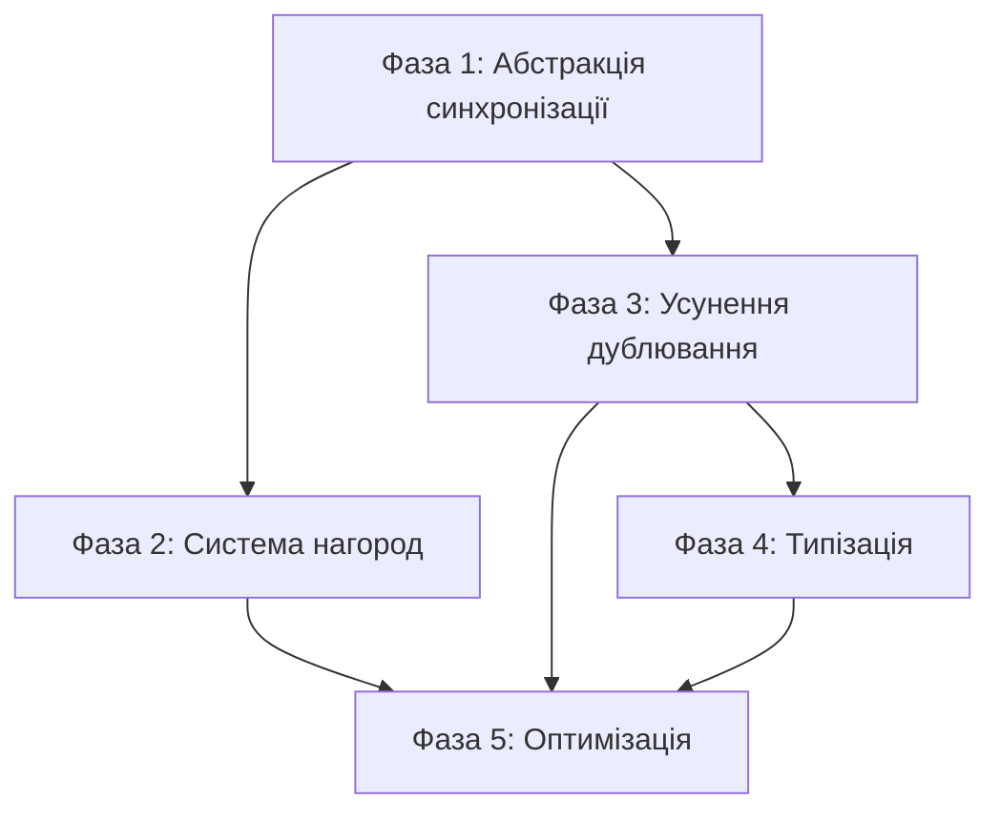

# План покращення архітектури v30

**Статус:** В процесі виконання  
**Дата:** 2025-12-09  
**Оновлено:** 2025-12-09

> [!NOTE]
> Фази 1, 2, 3 та частково 4 виконані. Див. деталі нижче.

Підготувати кодову базу до масштабування:
1. Розширення ігрових режимів: онлайн-гра через Firebase
2. Додавання системи нагород

> [!CAUTION]
> **Критичні обмеження рефакторингу:**
> 1. Візуалізація дошки (`game-board`) НЕ повинна впливати на `center-info` та логіку гри
> 2. `center-info` та логіка гри НЕ повинні знати про візуалізацію дошки
> 3. Зміни в `VirtualPlayerGameMode` НЕ повинні ламати `LocalGameMode` і навпаки
> 4. Враховувати всі попередження в коментарях щодо логіки, яка може зламатися

---

# Частина 1: Комплексний аудит коду

## Архітектура та Структура

### 1. SSoT (Single Source of Truth) — **Оцінка: 75/100**

**Сильні сторони:**
- ✅ Централізовані stores для стану гри (`boardStore`, `playerStore`, `scoreStore`, `uiStateStore`)
- ✅ `gameSettingsStore` як SSoT для налаштувань гри (457 рядків, добре структурований)
- ✅ Коментарі в коді підтверджують дотримання SSoT (наприклад, `LocalGameMode.getPlayersConfiguration()`)

**Проблеми:**
- ⚠️ 29 окремих stores — можлива надмірна фрагментація стану
- ⚠️ Деякі stores мають перетинну відповідальність (`uiStateStore` vs `uiEffectsStore`)
- ⚠️ `gameMode` зберігається як preset-назва, а не як об'єкт режиму

---

### 2. UDF (Unidirectional Data Flow) — **Оцінка: 80/100**

**Сильні сторони:**
- ✅ Чіткий потік: `userActionService` → `GameMode` → `gameLogicService` → `stores`
- ✅ `gameEventBus` для розв'язання циклічних залежностей
- ✅ `sideEffectService` для ізоляції побічних ефектів

**Проблеми:**
- ⚠️ Деякі компоненти напряму змінюють stores (обхід сервісів)
- ⚠️ `performMove` повертає `sideEffects` масив — непрямий спосіб керування

---

### 3. SoC (Separation of Concerns) — **Оцінка: 85/100**

**Сильні сторони:**
- ✅ Чітке розділення: `gameModes/` (9 файлів), `services/` (33 файли), `stores/` (29 файлів)
- ✅ OOP ієрархія GameModes: `BaseGameMode` → `TrainingGameMode` → `VirtualPlayerGameMode`
- ✅ `LocalGameMode` та `VirtualPlayerGameMode` — незалежні гілки від базового класу
- ✅ Дотримання "Золотого правила": візуалізація відокремлена від логіки

**Проблеми:**
- ⚠️ `gameSettingsStore` виконує занадто багато функцій (457 рядків)
- ⚠️ `userActionService` містить і UI-логіку, і бізнес-логіку (301 рядків)

---

### 4. Композиція — **Оцінка: 78/100**

**Сильні сторони:**
- ✅ 48 компонентів у `components/`
- ✅ Віджети винесені в окрему папку (`widgets/` — 16 файлів)
- ✅ `SvgIcons.svelte` централізує іконки

**Проблеми:**
- ⚠️ Деякі компоненти занадто великі (`Modal.svelte` — 29411 байт, `MainMenu.svelte` — 19281 байт)
- ⚠️ Дублювання `TestMainMenu.svelte` (19151 байт) — майже копія `MainMenu.svelte`

---

### 5. Чистота та Побічні ефекти — **Оцінка: 82/100**

**Сильні сторони:**
- ✅ `sideEffectService` для ізоляції побічних ефектів
- ✅ `speechService`, `audioService` — окремі сервіси для I/O
- ✅ `performMove` повертає структуру з `sideEffects` масивом

**Проблеми:**
- ⚠️ Таймери розкидані по різних сервісах (`timeService`, `TimerService`, `timerStore`)
- ⚠️ DOM-операції в деяких компонентах не ізольовані

---

## Якість Коду та Реалізації

### 6. DRY (Don't Repeat Yourself) — **Оцінка: 70/100**

**Сильні сторони:**
- ✅ Утиліти винесені в `utils/` (13 файлів)
- ✅ Конфігурація в `config/` (3 файли)

**Проблеми:**
- ⚠️ `TestMainMenu.svelte` — практично копія `MainMenu.svelte`
- ⚠️ Схожа логіка в `LocalGameMode` та `VirtualPlayerGameMode` (`continueAfterNoMoves`)
- ⚠️ Дублювання ініціалізації гравців у різних GameModes

---

### 7. Простота та Читабельність (KISS) — **Оцінка: 75/100**

**Сильні сторони:**
- ✅ Добре структуровані імена файлів та функцій
- ✅ Коментарі пояснюють "чому" (наприклад, в `gameLogicService.ts` рядки 44-48)
- ✅ TypeScript типізація в більшості файлів

**Проблеми:**
- ⚠️ `gameSettingsStore.applyPreset` — 203 рядки в одній функції
- ⚠️ Змішування `.js` та `.ts` файлів (непослідовність)
- ⚠️ Деякі параметри типізовані як `any` (наприклад, `currentState: any` в `performMove`)

---

### 8. Продуктивність — **Оцінка: 80/100**

**Сильні сторони:**
- ✅ `derivedState.ts` для обчислюваних значень
- ✅ `debounce.ts` для оптимізації частих операцій
- ✅ `cacheManager.js` для кешування

**Проблеми:**
- ⚠️ 29 stores можуть викликати зайві перерендери
- ⚠️ Відсутність `$derived` для деяких обчислюваних значень

---

### 9. Документація та Коментарі — **Оцінка: 85/100**

**Сильні сторони:**
- ✅ JSDoc коментарі в ключових файлах
- ✅ Пояснювальні коментарі "чому" (наприклад, в `gameLogicService.ts`)
- ✅ Попередження про критичну логіку (ВАЖЛИВО, ВИПРАВЛЕНО)
- ✅ README.md та GEMINI.md з інструкціями

**Проблеми:**
- ⚠️ Не всі функції мають JSDoc
- ⚠️ Деякі коментарі застарілі

---

## 📊 Зведена таблиця оцінок

| # | Критерій | Оцінка |
|---|----------|--------|
| 1 | SSoT (Single Source of Truth) | 75/100 |
| 2 | UDF (Unidirectional Data Flow) | 80/100 |
| 3 | SoC (Separation of Concerns) | 85/100 |
| 4 | Композиція | 78/100 |
| 5 | Чистота та Побічні ефекти | 82/100 |
| 6 | DRY (Don't Repeat Yourself) | 70/100 |
| 7 | Простота та Читабельність (KISS) | 75/100 |
| 8 | Продуктивність | 80/100 |
| 9 | Документація та Коментарі | 85/100 |
| | **Середня оцінка** | **79/100** |

---

# Частина 2: План покращень

## Пріоритетний список проблем

| Пріоритет | Проблема | Важливість | Опис |
|-----------|----------|------------|------|
| 1 | Відсутність абстракції для онлайн-синхронізації | **95/100** | Без цього неможливо реалізувати Firebase онлайн-режим |
| 2 | Відсутність системи подій для нагород | **90/100** | Потрібен механізм відстеження досягнень для системи нагород |
| 3 | Дублювання логіки між GameModes | **75/100** | `continueAfterNoMoves`, ініціалізація гравців — повторюється |
| 4 | Великі компоненти | **60/100** | `Modal.svelte` (29KB), `MainMenu.svelte` (19KB) важко підтримувати |
| 5 | Дублювання TestMainMenu | **55/100** | Порушення DRY, ускладнює підтримку |
| 6 | Змішування .js та .ts | **50/100** | Непослідовність типізації |
| 7 | Надмірна кількість stores | **45/100** | 29 stores — можлива фрагментація |
| 8 | Використання `any` типів | **40/100** | Втрата type-safety |
| 9 | Велика функція `applyPreset` | **35/100** | 203 рядки — важко читати |
| 10 | Розкидані таймери | **30/100** | `timeService`, `TimerService`, `timerStore` — дублювання |

---

## Чекбокси для виконання

### Фаза 1: Підготовка до онлайн-режиму (Firebase)

- [x] **1.1. Створити абстракцію синхронізації стану**
  - [x] Створити інтерфейс `IGameStateSync` з методами `push()`, `pull()`, `subscribe()`
  - [x] Реалізувати `LocalGameStateSync` (поточна поведінка без змін)
  - [x] Підготувати місце для `FirebaseGameStateSync`

- [x] **1.2. Рефакторинг `OnlineGameMode`**
  - [x] Перевірити та оновити `OnlineGameMode.ts` (2379 байт)
  - [x] Додати підтримку `IGameStateSync`
  - [ ] Інтегрувати з Firebase SDK (коли буде налаштовано)

- [x] **1.3. Оновити план Firebase**
  - [x] Додати деталі про структуру даних Firestore
  - [x] Уточнити правила безпеки
  - [x] Додати обробку офлайн-режиму

---

### Фаза 2: Підготовка системи нагород

- [x] **2.1. Створити систему подій для досягнень**
  - [x] Розширити `gameEventBus` подіями: `MOVE_COMPLETED`, `GAME_FINISHED`, `STREAK_ACHIEVED`
  - [x] Створити `rewardsEventHandler` для прослуховування подій

- [x] **2.2. Створити сервіс нагород**
  - [x] Розширити `rewardsService.ts` (1040 байт) 
  - [x] Додати типи нагород та умови їх отримання
  - [x] Реалізувати персистентність (localStorage або Firebase)

- [x] **2.3. Створити store для нагород**
  - [x] Створити `rewardsStore.ts` з типами для нагород
  - [x] Інтегрувати з системою подій

---

### Фаза 3: Усунення дублювання коду (DRY)

- [x] **3.1. Консолідація логіки GameModes**
  - [x] Витягти спільну логіку `continueAfterNoMoves` в `BaseGameMode`
  - [ ] Створити фабрику для конфігурації гравців
  - [x] ⚠️ **УВАГА:** Тестувати окремо LocalGameMode та VirtualPlayerGameMode

- [ ] **3.2. Видалити TestMainMenu.svelte**
  - [ ] Об'єднати з `MainMenu.svelte` через параметризацію
  - [ ] Або видалити, якщо не використовується

---

### Фаза 4: Покращення типізації

- [ ] **4.1. Міграція .js → .ts**
  - [ ] `logService.js` → `logService.ts`
  - [ ] `modalStore.js` → `modalStore.ts`
  - [ ] `voiceStore.js` → `voiceStore.ts`
  - [ ] Інші `.js` файли в `stores/` та `services/`

- [x] **4.2. Усунення `any` типів**
  - [x] `currentState: any` в `performMove` → створити тип `CombinedGameState`
  - [ ] `settings: any` → використовувати `GameSettingsState`
  - [x] `scoreChanges: any` → створити тип `ScoreChanges`

---

### Фаза 5: Оптимізація компонентів

- [ ] **5.1. Розбиття великих компонентів**
  - [ ] `Modal.svelte` (29KB) → виділити підкомпоненти
  - [ ] `MainMenu.svelte` (19KB) → виділити секції в окремі компоненти

- [ ] **5.2. Консолідація stores**
  - [ ] Об'єднати `uiStateStore` та `uiEffectsStore`
  - [ ] Переглянути необхідність `uiStore.js`

---

## Покращення плану Firebase

Після аналізу [Migrating-to-Firebase-for-online-mode.md](file:///c:/Users/ozapolnov/Documents/code/study/Stay_on_the_board/docs/plans/Migrating-to-Firebase-for-online-mode.md):

### Рекомендовані доповнення:

1. **Структура даних Firestore:**
```
game_sessions/{sessionId}
├── createdAt: timestamp
├── hostId: string
├── status: 'waiting' | 'playing' | 'finished'
├── gameState: {
│   ├── boardState: BoardState
│   ├── playerState: PlayerState
│   └── scoreState: ScoreState
│   }
├── players: Player[]
└── moves: Move[]
```

2. **Обробка конфліктів:**
   - Додати версіонування стану (`version: number`)
   - Реалізувати оптимістичні оновлення з rollback

3. **Офлайн-режим:**
   - Використовувати `enablePersistence()` для кешування
   - Показувати індикатор з'єднання

4. **Типізація:**
   - Створити TypeScript типи для Firestore документів
   - Використовувати `withConverter` для type-safe запитів

---

## Порядок виконання



---

## Верифікація

### Автоматичні тести
- Запустити існуючі Playwright тести: `npm run test`
- Запустити Vitest: `npm run test`

### Ручна верифікація
1. Перевірити всі ігрові режими: Training, Local, Virtual Player
2. Переконатися, що візуалізація дошки не впливає на `center-info`
3. Протестувати перемикання режимів
4. Перевірити збереження налаштувань
