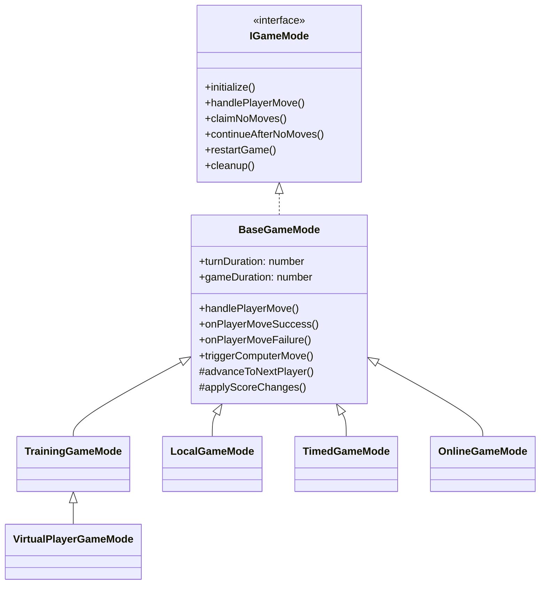

# 📁 Game Modes (`/lib/gameModes`)

Цей каталог містить **класи ігрових режимів** — реалізації паттерну Strategy для різних способів гри.

## 🏗️ Архітектурна роль



## 📚 Файли

| Файл | Клас | Призначення |
|:-----|:-----|:------------|
| `gameMode.interface.ts` | `IGameMode` | Інтерфейс для всіх режимів |
| `BaseGameMode.ts` | `BaseGameMode` | Базовий клас з спільною логікою |
| `TrainingGameMode.ts` | `TrainingGameMode` | Режим тренування (1 гравець vs AI) |
| `VirtualPlayerGameMode.ts` | `VirtualPlayerGameMode` | Режим з віртуальним гравцем |
| `LocalGameMode.ts` | `LocalGameMode` | Локальна гра (2+ гравців) |
| `TimedGameMode.ts` | `TimedGameMode` | Гра з таймером |
| `OnlineGameMode.ts` | `OnlineGameMode` | Онлайн мультиплеєр |
| `index.ts` | — | Re-export усіх режимів |

## 📝 Конвенції

1. **Наслідування**: Всі режими наслідують `BaseGameMode`
2. **Перевизначення**: Override методи через `protected`
3. **Без прямого імпорту**: Компоненти отримують режим через `gameModeService.getCurrentMode()`

## ⚠️ Критичні правила ізоляції

> [!CAUTION]
> **Ізоляція режимів:** Зміни в одному режимі НЕ повинні ламати інші режими.

### Відмінності `LocalGameMode` vs `VirtualPlayerGameMode`:

| Аспект | `LocalGameMode` | `VirtualPlayerGameMode` |
|:-------|:----------------|:------------------------|
| Рахунок | `roundScore` + `fixedScore` | Тільки `score` |
| Нарахування балів | `applyScoreChanges()` оновлює `roundScore` | Не нараховує бали |
| Раунди | `flushRoundScores()` в кінці раунду | Без раундів |
| Таймер | Є таймер ходу (`turnDuration`) | Без таймера |
| Наслідування | → `BaseGameMode` | → `TrainingGameMode` → `BaseGameMode` |

> [!WARNING]
> При рефакторингу `BaseGameMode` перевіряти ВСІ нащадки:
> - [ ] `TrainingGameMode`
> - [ ] `VirtualPlayerGameMode` 
> - [ ] `LocalGameMode`
> - [ ] `TimedGameMode`
> - [ ] `OnlineGameMode`

## 🔑 Ключові методи `BaseGameMode`

```typescript
// Публічні (з IGameMode)
initialize(options?)          // Ініціалізація гри
handlePlayerMove(dir, dist)  // Обробка ходу гравця
claimNoMoves()               // Заява "немає ходів"
continueAfterNoMoves()       // Продовження гри
restartGame(options?)        // Перезапуск
cleanup()                    // Очищення ресурсів
pauseTimers() / resumeTimers()

// Protected (для перевизначення)
advanceToNextPlayer()        // Перехід до наступного гравця
applyScoreChanges(data)      // Застосування змін рахунку
handleNoMoves(playerType)    // Обробка "немає ходів"
getPlayersConfiguration()    // Конфігурація гравців
getModeName()                // Назва режиму

// Спільна логіка (НЕ перевизначати без необхідності)
resetBoardForContinuation()  // Скидання дошки при "немає ходів"
onPlayerMoveSuccess(result)  // Успішний хід
onPlayerMoveFailure(reason)  // Невдалий хід
triggerComputerMove()        // Запуск ходу AI
startTurn()                  // Початок ходу (таймер)
```

## 🔗 Залежності

- GameModes можуть імпортувати:
  - Сервіси (`$lib/services/*`)
  - Стори (`$lib/stores/*`)
  - Типи та моделі
- GameModes НЕ повинні імпортувати:
  - Svelte-компоненти
  - CSS-файли
  - Інші GameModes (крім наслідування)

## 📋 Як додати новий режим

1. Створити файл `NewGameMode.ts`
2. Наслідувати від `BaseGameMode` (або відповідного батька)
3. Реалізувати обов'язкові abstract методи:
   - `getModeName()`
   - `getPlayersConfiguration()`
4. Перевизначити за потреби:
   - `initialize()`
   - `advanceToNextPlayer()`
   - `applyScoreChanges()`
   - `handleNoMoves()`
5. Додати експорт в `index.ts`
6. Зареєструвати в `gameModeService.ts`
