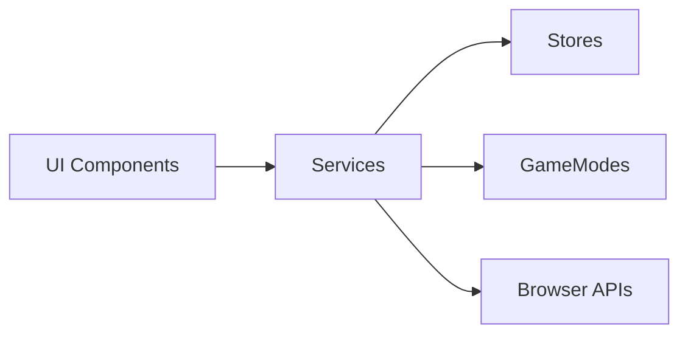

# 📁 Services (`/lib/services`)

Цей каталог містить **сервіси** — модулі, що інкапсулюють бізнес-логіку, побічні ефекти та операції з даними. Сервіси є посередниками між UI-компонентами та сторами.

## 🏗️ Архітектурна роль

## 📝 Конвенції

1. **Іменування**: `<назва>Service.ts` (напр. `gameService.ts`)
2. **Експорт**: Кожен сервіс експортує об'єкт з методами (`export const xyzService = { ... }`)
3. **Без стану**: Сервіси НЕ зберігають стан — вони працюють зі сторами
4. **Побічні ефекти**: Ізольовані через `sideEffectService.ts`
5. **Логування**: Використовувати `logService` замість `console.log`

## 📚 Категорії сервісів

### Ігрова логіка
| Файл | Призначення |
|:-----|:------------|
| `gameService.ts` | Ініціалізація нової гри |
| `gameLogicService.ts` | Чиста функція `performMove()` для обчислення ходів |
| `gameModeService.ts` | Керування активним режимом гри |
| `scoreService.ts` | Розрахунок балів та визначення переможця |
| `endGameService.ts` | Логіка завершення гри |
| `noMovesService.ts` | Обробка ситуації "немає ходів" |
| `availableMovesService.ts` | Обчислення доступних ходів |

### UI та взаємодія
| Файл | Призначення |
|:-----|:------------|
| `userActionService.ts` | Обробка дій користувача (вибір напрямку, рестарт) |
| `modalService.ts` | Показ модальних вікон (GameOver, підтвердження) |
| `hotkeyService.ts` | Глобальні гарячі клавіші |
| `gameHotkeyService.ts` | Гарячі клавіші під час гри |
| `navigationService.ts` | Навігація між сторінками |
| `uiService.ts` | Утиліти UI |

### Візуальні ефекти
| Файл | Призначення |
|:-----|:------------|
| `animationService.ts` | Черга анімацій руху фішки |
| `speechService.ts` | Text-to-Speech для озвучення ходів |
| `audioService.ts` | Звукові ефекти |

### Голосове керування
| Файл | Призначення |
|:-----|:------------|
| `voiceControlService.ts` | Розпізнавання голосових команд |

### Інфраструктура
| Файл | Призначення |
|:-----|:------------|
| `logService.ts` | Централізоване логування з групами |
| `gameEventBus.ts` | Шина подій для декаплінгу (GameOver, Replay) |
| `sideEffectService.ts` | Ізоляція побічних ефектів |
| `timeService.ts` | Таймери гри та ходу |
| `testModeService.ts` | Сервіс для тестового режиму |
| `SettingsPersistenceService.ts` | Збереження налаштувань в localStorage |

### Зовнішні інтеграції
| Файл | Призначення |
|:-----|:------------|
| `firebaseService.ts` | Ініціалізація Firebase (для онлайн-режиму) |
| `serverSyncService.ts` | Синхронізація з сервером |

### Система нагород
| Файл | Призначення |
|:-----|:------------|
| `rewardsService.ts` | Перевірка досягнень |

## ⚠️ Важливі правила

> [!CAUTION]
> **Золоте правило:** Сервіси, що працюють з логікою гри, НЕ повинні залежати від візуальних компонентів (`game-board`, анімацій).

> [!IMPORTANT]
> - Використовуйте `gameEventBus` для комунікації між незв'язаними модулями
> - Не викликайте `store.update()` напряму з сервісів — використовуйте методи сторів
> - Всі публічні методи мають бути типізовані

## 🔗 Залежності

- Сервіси можуть імпортувати:
  - Інші сервіси
  - Стори (`$lib/stores/*`)
  - Утиліти (`$lib/utils/*`)
  - Типи (`$lib/types/*`, `$lib/models/*`)
- Сервіси НЕ повинні імпортувати:
  - Svelte-компоненти
  - CSS-файли
