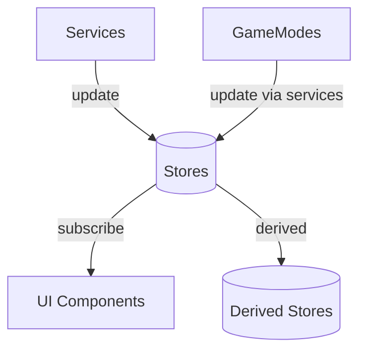

# 📁 Stores (`/lib/stores`)

Цей каталог містить **Svelte Stores** — реактивні сховища стану додатку. Стори є **SSoT (Single Source of Truth)** для всіх даних.

## 🏗️ Архітектурна роль



## 📝 Конвенції

1. **Іменування**: `<назва>Store.ts` (напр. `boardStore.ts`)
2. **Експорт**: 
   - Інтерфейс стану: `export interface XyzState { ... }`
   - Стор: `export const xyzStore = createXyzStore();`
3. **Фабрика**: Використовувати патерн фабрики `createXyzStore()` для інкапсуляції
4. **Без побічних ефектів**: Стори НЕ викликають API, DOM, таймери
5. **Типізація**: Всі стори мають строго типізований інтерфейс

## 📚 Категорії сторів

### Ігровий стан (Core Game State)
| Файл | Призначення | SSoT для |
|:-----|:------------|:---------|
| `boardStore.ts` | Стан дошки | Позиція фішки, розмір, відвідані клітинки |
| `playerStore.ts` | Стан гравців | Список гравців, поточний гравець |
| `scoreStore.ts` | Стан рахунку | Бали, бонуси, штрафи |
| `uiStateStore.ts` | Стан UI гри | Вибраний напрямок, isGameOver |
| `gameStore.ts` | Активний режим гри | Посилання на IGameMode |
| `gameOverStore.ts` | Дані завершення гри | Переможець, причина |

### Налаштування
| Файл | Призначення | SSoT для |
|:-----|:------------|:---------|
| `gameSettingsStore.ts` | Налаштування гри | Розмір дошки, Block Mode, голос |
| `appSettingsStore.ts` | Налаштування додатку | Мова, тема |

### Похідний стан (Derived)
| Файл | Призначення |
|:-----|:------------|
| `derivedState.ts` | Обчислювані значення: `currentPlayer`, `visualPosition`, `isPlayerTurn` |
| `availableMovesStore.ts` | Доступні ходи (оновлюється сервісом) |

### UI/UX
| Файл | Призначення |
|:-----|:------------|
| `modalStore.ts` | Стан модальних вікон (стек) |
| `animationStore.ts` | Черга анімацій |
| `layoutStore.ts` | Розташування колонок |
| `tooltipStore.ts` | Підказки |
| `uiEffectsStore.ts` | Візуальні ефекти |
| `focusManager.ts` | Керування фокусом |

### Таймери
| Файл | Призначення |
|:-----|:------------|
| `timerStore.ts` | Залишковий час гри/ходу |

### Спеціальні режими
| Файл | Призначення |
|:-----|:------------|
| `gameModeStore.ts` | Активний режим (training/local/online) |
| `testModeStore.ts` | Тестовий режим (для e2e тестів) |
| `replayStore.ts` | Перегляд повтору гри |
| `replayAutoPlayStore.ts` | Автопрогравання повтору |

### Голос
| Файл | Призначення |
|:-----|:------------|
| `voiceStore.ts` | Список доступних голосів |
| `voiceControlStore.ts` | Стан голосового керування |

### Нагороди
| Файл | Призначення |
|:-----|:------------|
| `rewardsStore.ts` | Досягнення та прогрес |

### Інші
| Файл | Призначення |
|:-----|:------------|
| `debugLogStore.ts` | Логи для відладки |
| `versionStore.ts` | Версія додатку |
| `notificationStore.ts` | Нотифікації |
| `isModalOpenStore.ts` | Чи відкрито модальне вікно |

## ⚠️ Важливі правила

> [!CAUTION]
> **SSoT:** Кожен фрагмент даних має ОДНЕ джерело правди. НЕ дублювати стан між сторами.

> [!WARNING]
> - НЕ викликати `store.set()` напряму з компонентів — використовувати сервіси
> - НЕ зберігати похідні дані — використовувати `derived()`
> - НЕ мутувати об'єкти напряму — завжди повертати новий об'єкт

> [!IMPORTANT]
> Для складних оновлень використовувати методи стору замість `update()`:
> ```typescript
> // ❌ Погано
> boardStore.update(s => ({ ...s, playerRow: 1 }))
> 
> // ✅ Добре
> boardStore.movePlayer(1, 2)
> ```

## 🔗 Залежності

- Стори можуть імпортувати:
  - Інші стори (тільки для `derived()`)
  - `logService` (для логування)
  - Типи та утиліти
- Стори НЕ повинні імпортувати:
  - Сервіси (крім `logService`)
  - Svelte-компоненти
